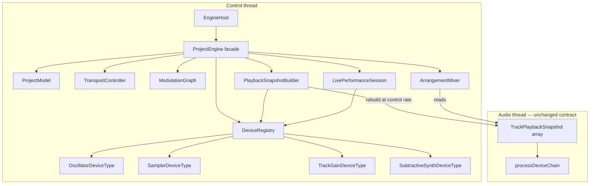

# ProjectEngine refactor plan (M12)

## Problem statement

`ProjectEngine` violates separation of concerns. It mixes **authoritative project state**, **device-specific business rules**, **transport**, **modulation**, **realtime snapshot building**, and **audio rendering orchestration** in one class with duplicated flat device structs.

### Current size & hotspots

| File | LOC | Hotspot |
|------|-----|---------|
| `ProjectEngine.cpp` | ~1,627 | `setDeviceParameter` (~210 lines), `rebuildTrackPlaybackLocked`, mix path, clip CRUD, serialization |
| `ProjectEngine_live.cpp` | ~245 | live instrument build duplicates device field knowledge |
| `ProjectEngine.hpp` | ~363 | `Device` / `DeviceState` 45+ fields × 2 |

**Type dispatch count:** ~69 `device->type` / `parameterId` branches in `ProjectEngine.cpp` alone.

### What US-10-01 already fixed (playback layer only)

- `DeviceNodePlayback.params` → `std::variant<OscillatorParams, SamplerParams, …>`
- `DeviceChain.cpp` → per-type `applyModulation` + `processDevice` overloads

### What remains monolithic (control layer)

- Flat `Device` / `DeviceState` with every parameter for every device type
- `copyDeviceToState` / `copyStateToDevice` — manual field copies
- `addDeviceToTrack` — per-type default blocks
- `setDeviceParameter` / `setDeviceStringParameter` — giant if-else
- `buildLiveInstrumentForTrack` — another per-type switch
- Mix + LFO + transport + clips embedded in same class

---

## Target architecture



### Layer rules

| Layer | Thread | May allocate | Knows about |
|-------|--------|--------------|-------------|
| `IDeviceType` + instances | Control | Yes | Its params, JSON, playback node shape |
| `ProjectModel` | Control | Yes | Tracks, clips, device chain order |
| `PlaybackSnapshotBuilder` | Control | Yes (on rebuild) | SampleBank PCM pointers, device registry |
| `TrackPlaybackSnapshot` | Audio read | No | Flat C structs, variant params |
| `ArrangementMixer` | Audio | No (preallocated buffers) | Snapshots only |

---

## Per-device class design

Each built-in device gets a **control-thread type class** (not audio-thread polymorphism):

```cpp
// Conceptual — see US-12-01 for exact API
struct IDeviceType {
    virtual std::string_view typeId() const = 0;
    virtual DeviceInstance createDefault(std::string id) const = 0;
    virtual bool setParameter(DeviceInstance& inst, std::string_view paramId, float value) = 0;
    virtual bool setStringParameter(DeviceInstance& inst, std::string_view paramId, std::string_view value) = 0;
    virtual void appendJsonFields(const DeviceInstance& inst, juce::DynamicObject& obj) const = 0;
    virtual bool readJsonFields(DeviceInstance& inst, const juce::var& obj) const = 0;
    virtual void buildPlaybackNode(const DeviceInstance& inst,
                                     const PlaybackBuildContext& ctx,
                                     DeviceNodePlayback& out) const = 0;
    virtual bool buildLiveInstrument(const DeviceInstance& inst,
                                     LiveInstrumentSnapshot& out) const = 0;
};
```

**Shared strip params** (`gain`, `pan`, `bypassed`) live on a `DeviceSlot` wrapper so every device doesn't reimplement them:

```cpp
struct DeviceSlot {
    std::string id;
    float gain = 1.0f;
    float pan = 0.5f;
    bool bypassed = false;
    DeviceInstance instance; // variant of typed device states
};
```

---

## Migration phases (M12 stories)

| Phase | Stories | Outcome |
|-------|---------|---------|
| **0 — Plan** | US-12-00 | ADR accepted, this doc, ticket manifest |
| **1 — Device framework** | US-12-01, US-12-02 | Registry + 4 device type classes (parallel impl ok after 12-01) |
| **2 — Control model** | US-12-03, US-12-04 | Variant device instances; parameter dispatch out of ProjectEngine |
| **3 — Domain extraction** | US-12-05, US-12-06, US-12-07 | Tracks/clips, transport, modulation in own modules |
| **4 — Audio path** | US-12-08, US-12-09 | Snapshot builder + arrangement mixer extracted |
| **5 — Live + facade** | US-12-10, US-12-11 | Live session extracted; ProjectEngine ≤400 LOC |
| **6 — Gate** | US-12-20 | Full regression demo |

### Order constraints

```text
US-12-00
  └─ US-12-01 (registry)
       ├─ US-12-02 (device types) ── US-12-03 (variant model) ── US-12-04 (param service)
       ├─ US-12-05 (tracks/clips)     [can start after 12-01]
       ├─ US-12-06 (transport)        [can start after 12-01]
       └─ US-12-07 (modulation)       [can start after 12-01]
US-12-08 depends on 12-02, 12-03, 12-07
US-12-09 depends on 12-08
US-12-10|10 depends on 12-02
US-12-11 depends on all above
US-12-20 last
```

---

## Testing strategy

Every story keeps **behavior identical** to pre-refactor:

| Test | Validates |
|------|-----------|
| Existing `device_chain_test`, `subtractive_synth_test`, `lfo_modulation_test` | Playback unchanged |
| `project_serialization_test` | Save/load round-trip |
| New `device_registry_test` | Per-type param + JSON |
| New `playback_snapshot_builder_test` | PCM resolution, variant fill |
| Flutter 51/51 | Bridge contract unchanged |

No Flutter or bridge changes unless JSON schema version bump (avoid in M12).

---

## Explicit non-goals (M12)

- External plugin hosting
- Send/receive routing graph
- UI/editor changes
- New device types (only re-home existing four)
- Audio-thread virtual device graph
- Faust / codegen DSP

---

## Success metrics

- [ ] `ProjectEngine.cpp` ≤ 400 LOC (facade + wiring)
- [ ] Zero `device->type` string compares outside `DeviceRegistry` / device type classes
- [ ] Flat `DeviceState` with 45+ fields removed
- [ ] Adding a hypothetical fifth device touches ≤ 3 files: new `*DeviceType.cpp`, registry registration, optional `DeviceChain` process overload
- [ ] All C++ + Flutter tests green; manual device smoke unchanged
