# File Ownership: DeviceChainScratchManager

## Overview
Define precise file ownership and change permissions for the DeviceChainScratchManager implementation. This document establishes clear boundaries between implementation packages and prevents conflicts while ensuring required integration.

## Ownership Principles

### Exclusive Ownership
- **Single Owner**: Each work package owns exclusive rights to its assigned files
- **No Cross-Package Edits**: No package may edit files owned by another package
- **No Unauthorized Access**: Implementation teams must verify file ownership before editing

### Shared Files (Protected Read-Only)
- **Core Type Definitions**: Headers containing fundamental data structures
- **Cross-Component Dependencies**: Files required by multiple packages
- **Public APIs**: Interfaces that must remain consistent across all packages

### Integration Files
- **Shared Implementation**: Files that coordinate multiple packages
- **Adapter Layer**: Interface files that bridge package boundaries
- **Contract Definitions**: Documentation and contract specifications

## Detailed File Ownership Table

### Package 1: DeviceChainScratchManager

| File | Owner | Allowed Changes | Forbidden Changes | Dependencies |
|------|-------|-----------------|------------------|--------------|
| `include/audioapp/DeviceChainScratchManager.hpp` | Owner | Interface definition, member accessor implementations, static utility functions | Changing public API, removing thread-local storage, modifying scratch structure layout | None |
| `src/DeviceChainScratchManager.cpp` | Owner | Thread-local storage implementation, utility function definitions, scratch buffer management | Moving scratch space logic to other files, changing thread-local pattern, modifying file ownership | `DeviceChainScratchManager.hpp` |
| `include/audioapp/DeviceChainScratch.hpp` | Owner | Complete scratch structure definition, field documentation, size verification | Removing fields, changing layout, adding inheritance, modifying buffer sizes | None |

### Package 2: DeviceChainOrchestrator

| File | Owner | Allowed Changes | Forbidden Changes | Dependencies |
|------|-------|-----------------|------------------|--------------|
| `include/audioapp/DeviceChainOrchestrator.hpp` | Owner | Interface definition, orchestration logic | Removing scratch manager usage, changing scratch access pattern | `DeviceChainScratchManager.hpp` |
| `src/DeviceChainOrchestrator.cpp` | Owner | Core audio processing, scratch buffer consumption | Implementing scratch management logic, modifying thread-local access | `DeviceChainScratchManager.hpp`, `DeviceChainScratchManager.cpp` |
| `src/DeviceChainOrchestrator_impl.cpp` | Owner | Helper functions for orchestration, scratch integration | Scratch space management, device-specific logic | Main orchestrator |

### Package 3: DeviceChainAutomationModulation

| File | Owner | Allowed Changes | Forbidden Changes | Dependencies |
|------|-------|-----------------|------------------|--------------|
| `include/audioapp/DeviceChainAutomationModulation.hpp` | Owner | Interface definition, automation/LFO logic | Changing automation contracts, modifying parameter processing | None |
| `src/DeviceChainAutomationModulation.cpp` | Owner | Automation/LFO application, per-frame gain/pan computation | Modifying core automation semantics, scratch space management | `DeviceChainScratchManager.hpp` |

### Package 4: DeviceChainInstrumentPipeline

| File | Owner | Allowed Changes | Forbidden Changes | Dependencies |
|------|-------|-----------------|------------------|--------------|
| `include/audioapp/DeviceChainInstrumentPipeline.hpp` | Owner | Pipeline interface, device coordination | Major architectural changes, removing device processing | None |
| `src/DeviceChainInstrumentPipeline.cpp` | Owner | Device processing logic, scratch note region access | Scratch buffer management, device-specific implementation | `DeviceChainScratchManager.hpp` |

### Package 5: DeviceChainDeviceAdapters

| File | Owner | Allowed Changes | Forbidden Changes | Dependencies |
|------|-------|-----------------|------------------|--------------|
| `include/audioapp/DeviceChainDeviceAdapters.hpp` | Owner | Adapter interfaces, type mappings | Changing device signatures, modifying adapter contracts | None |
| `src/DeviceChainDeviceAdapters.cpp` | Owner | Adapter implementations | Modifying original device logic, scratch space management | Orchestration layer |

### Package 6: Integration & Testing

| File | Owner | Allowed Changes | Forbidden Changes | Dependencies |
|------|-------|-----------------|------------------|--------------|
| `tests/DeviceChainScratchManagerTest.hpp` | Owner | Test framework interface, contract validation | Changing test contracts, modifying test requirements | `DeviceChainScratchManager.hpp` |
| `tests/DeviceChainScratchManagerTest.cpp` | Owner | Unit tests, thread safety verification | Implementing production logic, changing test contracts | `DeviceChainScratchManager.hpp` |

## File Classification

### Implementation Files
- **Owned by Package 1**: All scratch manager implementation files
- **Owned by Other Packages**: Files they consume (scratch manager is consumed by multiple packages)

### Documentation Files
- **Contract Documentation**: All .md files in docs/features/device-chain-scratch-manager/
- **Architecture Documentation**: All architectural and design documents

### Shared Files (Read-Only Dependencies)
- **Core Type Headers**: All scratch-related type definitions
- **Public Headers**: Interface definitions that must remain stable

## Ownership Rules

### Primary Owner Rights
The owner of a package has:
1. **Full Implementation Rights**: Can implement, optimize, and extend within package scope
2. **Contract Compliance**: Must ensure implementation matches package contracts
3. **Performance Optimization**: Can optimize within package boundaries
4. **Bug Fixes**: Can fix bugs within package scope
5. **Code Quality**: Can improve code quality within package scope

### Cross-Package Access Rules
1. **Read Access**: Packages may read from owned files if listed in dependencies
2. **Write Access**: Packages may write to owned files only if they are the owner
3. **Modification Restrictions**: No package may modify files owned by others
4. **Dependency Updates**: Package owners must update dependencies when changing interfaces

### Integration Files
Integration files may be modified by multiple packages:
1. **Adapter Files**: Files that bridge package boundaries
2. **Shared Utilities**: Common functionality used by multiple packages
3. **Contract Definitions**: Architecture and design documents
4. **Test Infrastructure**: Shared testing framework

## Conflict Resolution

### File Access Conflicts
1. **Exclusive Ownership**: If two packages need the same file, one must be owner
2. **Integration File Required**: Conflict can be resolved by making file an integration file
3. **Dependency Chain**: Earlier dependency gets ownership
4. **Architecture Decision**: Package architect resolves conflicts

### API Changes
1. **Forward Compatibility**: Breaking changes require new version
2. **Backward Compatibility**: Must maintain existing API for consumers
3. **Deprecation Path**: Gradual migration for breaking changes
4. **Integration Testing**: Comprehensive testing for API changes

## Integration Points

### Package Dependencies
1. **Package 1 → Package 2,3,4,5**: Scratch manager provides to all consumers
2. **Package 1 → Package 6**: Scratch manager provides test data
3. **Package 2 → Package 1**: Orchestrator uses scratch manager
4. **Package 3 → Package 1**: Automation uses scratch manager
5. **Package 4 → Package 1**: Instrument pipeline uses scratch manager
6. **Package 5 → Package 2**: Adapters work with orchestrator

### File Dependencies

```mermaid
graph TD
    Package1[Package 1: DeviceChainScratchManager] --> Package2
    Package1 --> Package3
    Package1 --> Package4
    Package1 --> Package5
    Package1 --> Package6
    
    Package2 --> Package1
    Package3 --> Package1
    Package4 --> Package1
    Package5 --> Package2
    
    subgraph "Package 1 Files"
        A[DeviceChainScratchManager.hpp]
        B[DeviceChainScratchManager.cpp]
        C[DeviceChainScratch.hpp]
    end
    
    subgraph "Package 2 Files"
        D[DeviceChainOrchestrator.hpp]
        E[DeviceChainOrchestrator.cpp]
        F[DeviceChainOrchestrator_impl.cpp]
    end
    
    subgraph "Package 3 Files"
        G[DeviceChainAutomationModulation.hpp]
        H[DeviceChainAutomationModulation.cpp]
    end
    
    subgraph "Package 4 Files"
        I[DeviceChainInstrumentPipeline.hpp]
        J[DeviceChainInstrumentPipeline.cpp]
    end
    
    subgraph "Package 5 Files"
        K[DeviceChainDeviceAdapters.hpp]
        L[DeviceChainDeviceAdapters.cpp]
    end
    
    subgraph "Package 6 Files"
        M[DeviceChainScratchManagerTest.hpp]
        N[DeviceChainScratchManagerTest.cpp]
    end
    
    A -.-> D
    A -.-> G
    A -.-> I
    A -.-> K
    A -.-> M
    
    D -.-> A
    G -.-> A
    I -.-> A
    K -.-> D
```

## File Modification Guidelines

### Safe Modifications
1. **Interface Extensions**: Can add new methods to class interfaces
2. **Implementation Optimizations**: Can optimize internal implementations
3. **Bug Fixes**: Can fix bugs within package scope
4. **Code Quality**: Can improve readability and maintainability
5. **Performance**: Can optimize performance within package scope

### Forbidden Modifications
1. **Public API Changes**: Cannot change public method signatures
2. **File Ownership Transfer**: Cannot change file ownership between packages
3. **Contract Violations**: Cannot break existing contracts
4. **Cross-Package Dependencies**: Cannot add unauthorized dependencies
5. **Interface Breaking Changes**: Cannot break consumer interfaces

## Ownership Enforcement

### Review Process
1. **Code Review**: All changes must be reviewed by package owner
2. **Integration Testing**: All cross-package changes must be tested
3. **Contract Validation**: All changes must comply with contracts
4. **Performance Testing**: All changes must meet performance requirements

### Change Management
1. **Change Request**: All changes require approval
2. **Impact Analysis**: Impact on other packages must be analyzed
3. **Test Coverage**: Additional tests for cross-package changes
4. **Documentation**: All changes must be documented

## File Cleanup

### Deprecation Process
1. **Mark Deprecated**: Use deprecation warnings
2. **Gradual Migration**: Provide migration path
3. **Test Migration**: Ensure migration works correctly
4. **Remove Final**: Remove when no users remain

### Legacy File Handling
1. **Archive**: Move unused files to archive
2. **Documentation**: Update documentation
3. **Testing**: Update tests to use new files
4. **Build System**: Update build dependencies

## Conclusion

**File Ownership Summary**:
DeviceChainScratchManager file ownership establishes clear boundaries for implementation. Each package owns its files, with well-defined dependencies and access rules. This prevents conflicts while enabling parallel development.

**Key Ownership Principles**:
1. **Exclusive Ownership**: Each package owns its files
2. **Clear Dependencies**: Well-defined dependency graph
3. **Integration Files**: Shared files for coordination
4. **No Cross-Package Modifications**: Prevents integration conflicts
5. **Contract Compliance**: All changes must comply with contracts

**Implementation Requirements**:
- Implement exactly assigned files
- Respect file ownership boundaries
- Follow dependency rules
- Comply with cross-package access rules
- Maintain integration file contracts

**Ready for Implementation**:
This file ownership table is ready for implementation. All package files, ownership rules, and integration points are clearly defined.