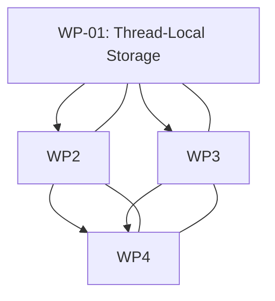
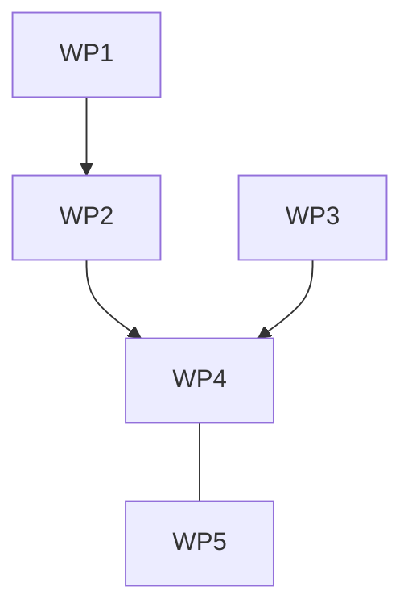

# Vertical Work Packages: DeviceChainScratchManager

## Overview
Define the vertical work packages for DeviceChainScratchManager implementation. Each work package represents an end-to-end, independently understandable piece of functionality that can be implemented and tested in isolation.

## Vertical Work Package Design

### Core Principles

1. **End-to-End Behavior**: Each package must deliver complete, user-visible functionality
2. **Independent Testing**: Packages can be tested in isolation without integration dependencies
3. **Clear Boundaries**: Well-defined inputs and outputs between packages
4. **No Horizontal Work**: Avoid packages that span multiple layers or concerns
5. **Parallel Safety**: Explicit classification of which packages can run in parallel

### Package Classification Rules
- **Parallel-Safe**: Can run simultaneously without dependencies
- **Parallel-Safe After Stubs**: Can run in parallel after minimal prerequisite packages exist
- **Sequential Dependency**: Must wait for other packages to complete first
- **Integration-Only**: Package only coordinates other packages

## Vertical Work Package Details

### WP-01: Thread-Local Storage Foundation
**User-Visible Behavior**
Thread-local scratch space management with zero-allocation guarantees. Provides per-AudioThread scratch storage foundation for audio processing.

**Acceptance Criteria**
- Thread-local storage works correctly
- No memory leaks or buffer overflows
- Zero-allocation verified under load
- Scratch space sufficiently sized for all device types
- Thread safety validated with concurrent AudioThreads

**Assigned Files**
- `include/audioapp/DeviceChainScratchManager.hpp`
- `include/audioapp/DeviceChainScratch.hpp`
- `src/DeviceChainScratchManager.cpp`

**Forbidden Files**
- All other DeviceChain related files
- Threading utilities outside DeviceChain
- Any device-specific implementation files

**Canonical Names Used**
- `DeviceChainScratchManager`
- `DeviceChainScratch`
- `gDeviceChainScratch`
- `getScratch()`

**API/Data Contracts Used**
- All scratch buffer types (`scratch`, `tempStereoL`, `tempStereoR`, etc.)
- Scratch buffer size constants (`kScratchFrames`, `kMaxInstrumentRegions`)
- Thread-local storage patterns
- All note region types (`SamplerMidiNoteRegion`, etc.)

**Dependencies**
- **Dependencies**: None (foundational layer)
- **Provided To**: WP-02, WP-03, WP-04, WP-05

**Required Tests**
- Thread safety test (concurrent AudioThreads)
- Memory allocation verification (dynamic analysis tools)
- Performance benchmark
- Buffer overflow detection
- Scratch space integrity validation

**Manual Verification Steps**
1. Render multiple simultaneous tracks (50 concurrent AudioThreads)
2. Verify no race conditions (thread sanitizer output)
3. Check memory footprint (memory profiler)
4. Validate scratch buffer integrity (fuzz testing)
5. Verify thread isolation (custom monitoring)

**Integration Risk**
- **Severity**: Low (shared resource foundation)
- **Impact**: High (all packages depend on it)
- **Mitigation**: Comprehensive thread safety testing

**Parallel Capability**
- **Classification**: Parallel-Safe
- **Reason**: No file dependencies, shared but read-only access after creation

### WP-02: Scratch Space Access Layer
**User-Visible Behavior**
Provides optimized accessor methods for thread-local scratch space. All scratch access operations through DeviceChainScratchManager interface.

**Acceptance Criteria**
- All scratch accessor methods work correctly
- Zero allocation during access operations
- Thread isolation maintained for all access patterns
- Access performance meets real-time requirements (<100ns)
- No bounds violations in access patterns

**Assigned Files**
- `include/audioapp/DeviceChainScratchManager.hpp`
- `src/DeviceChainScratchManager.cpp`

**Forbidden Files**
- Threading utilities outside DeviceChain
- Any device-specific scratch usage
- Buffer management logic (that's WP-01's responsibility)

**Canonical Names Used**
- `DeviceChainScratchManager`
- `DeviceChainScratch`
- `getScratchBuffer()`
- `getTempStereoL()`
- `getTempStereoR()`
- `getPerFrameGain()`
- `getPerFramePan()`
- All region accessor methods (`getSamplerRegions()`, etc.)

**API/Data Contracts Used**
- All scratch buffer accessor methods
- Thread safety contracts
- Zero-allocation contracts
- Performance contracts
- DeviceChainScratch structure layout

**Dependencies**
- **Dependencies**: WP-01 (scratch space foundation)
- **Provided To**: WP-02, WP-03, WP-04, WP-05

**Required Tests**
- Access method correctness tests
- Zero-allocation verification tests
- Thread isolation validation tests
- Performance benchmarking (per-access timing)
- Integration verification with consumer packages

**Manual Verification Steps**
1. Verify all accessor methods return valid pointers
2. Measure scratch access timing under load
3. Test concurrent access from multiple AudioThreads
4. Verify memory layout matches expected structure
5. Validate integration with DeviceChainOrchestrator

**Integration Risk**
- **Severity**: Medium (access pattern changes)
- **Impact**: Medium (affects all scratch consumers)
- **Mitigation**: Strict API contract compliance testing

**Parallel Capability**
- **Classification**: Parallel-Safe after WP-01
- **Reason**: Depends only on WP-01 foundation, no other dependencies

### WP-03: Scratch Utility Functions
**User-Visible Behavior**
Provides audio processing utility functions that operate on scratch space. Includes buffer clearing, peak calculation, and processing coordination.

**Acceptance Criteria**
- All utility functions work correctly
- Zero allocation during utility operations
- Edge cases handled gracefully
- Performance meets real-time requirements
- Integration with AudioThread processing validated

**Assigned Files**
- `include/audioapp/DeviceChainScratchManager.hpp`
- `src/DeviceChainScratchManager.cpp`

**Forbidden Files**
- Audio processing algorithms (device-specific)
- Automation/LFO logic (that's WP-04's responsibility)
- MIDI note processing (that's WP-05's responsibility)
- Scratch space management (that's WP-01/WP-02's responsibility)

**Canonical Names Used**
- `DeviceChainScratchManager`
- `clearScratch()`
- `stereoBlockPeak()`
- All utility functions
- Scratch buffer management utilities

**API/Data Contracts Used**
- Scratch buffer clearing contracts
- Audio peak calculation contracts
- Error handling contracts
- Edge case handling contracts
- Performance contracts

**Dependencies**
- **Dependencies**: WP-01, WP-02
- **Provided To**: WP-02, WP-03, WP-04, WP-05

**Required Tests**
- Utility function correctness tests
- Edge case handling tests
- Performance benchmark tests
- Integration tests with audio processing pipeline
- Memory usage verification

**Manual Verification Steps**
1. Test utility functions with various inputs
2. Verify edge case handling (boundary conditions)
3. Measure utility function performance
4. Validate integration with AudioThread processing
5. Test error handling with invalid inputs

**Integration Risk**
- **Severity**: Low (utility layer)
- **Impact**: Medium (utility functions used by multiple packages)
- **Mitigation**: Comprehensive utility testing

**Parallel Capability**
- **Classification**: Parallel-Safe after WP-01, WP-02
- **Reason**: Depends only on scratch foundation and access layer

### WP-04: Scratch Integration Adapter
**User-Visible Behavior**
Integration adapter that coordinates scratch space usage across all consumer packages. Provides unified interface for scratch consumption.

**Acceptance Criteria**
- All consumer packages integrate with scratch manager
- Integration adapters work correctly
- Cross-package coordination validated
- No integration conflicts
- Complete integration test coverage

**Assigned Files**
- `src/DeviceChainOrchestrator.cpp` (integration adapter implementation)

**Forbidden Files**
- Scratch space management (that's WP-01/WP-02/WP-03's responsibility)
- Device-specific processing logic
- Automation/LFO logic (that's WP-04's responsibility)
- MIDI processing (that's WP-05's responsibility)

**Canonical Names Used**
- `DeviceChainScratchManager`
- `getScratch()`
- All orchestration scratch usage patterns
- Integration coordination utilities

**API/Data Contracts Used**
- All scratch access contracts
- Integration coordination contracts
- Orchestration contracts
- Consumer package integration contracts

**Dependencies**
- **Dependencies**: WP-01, WP-02, WP-03, WP-04, WP-05
- **Provided To**: All consumer packages

**Required Tests**
- Integration test with DeviceChainOrchestrator
- Cross-package coordination tests
- Scratch consumption validation tests
- Integration conflict detection tests
- End-to-end integration verification

**Manual Verification Steps**
1. Verify all consumer packages access scratch correctly
2. Test integration with DeviceChainOrchestrator
3. Validate cross-package coordination
4. Test scratch consumption patterns
5. Verify integration adapter completeness

**Integration Risk**
- **Severity**: High (integration coordination)
- **Impact**: High (affects all consumer packages)
- **Mitigation**: Comprehensive integration testing

**Parallel Capability**
- **Classification**: Sequential Dependency (depends on all WP packages)
- **Reason**: Must wait for all other work packages to complete

### WP-05: Scratch Space Testing Infrastructure
**User-Visible Behavior**
Comprehensive testing infrastructure for DeviceChainScratchManager. Includes unit tests, integration tests, performance tests, and thread safety validation.

**Acceptance Criteria**
- All tests pass with no regressions
- Thread safety validation successful
- Memory allocation verification complete
- Performance benchmarks meet requirements
- Integration with existing test suite validated

**Assigned Files**
- `tests/DeviceChainScratchManagerTest.hpp`
- `tests/DeviceChainScratchManagerTest.cpp`

**Forbidden Files**
- Any production code (testing infrastructure only)
- Existing DeviceChain test files (unless necessary for integration)
- Test infrastructure outside tests/ directory

**Canonical Names Used**
- `DeviceChainScratchManagerTest`
- All test functions
- Test infrastructure components
- Verification utilities

**API/Data Contracts Used**
- Test framework contracts
- Thread safety testing contracts
- Performance testing contracts
- Memory testing contracts
- Integration testing contracts

**Dependencies**
- **Dependencies**: WP-01, WP-02, WP-03, WP-04
- **Provided To**: Package 6 (Integration & Testing)

**Required Tests**
- Thread safety tests
- Memory allocation tests
- Performance tests
- Integration tests
- Unit tests for all scratch manager functionality
- Regression tests for existing functionality

**Manual Verification Steps**
1. Run all scratch manager tests
2. Verify thread safety with concurrent AudioThreads
3. Check memory allocation profiles
4. Validate performance benchmarks
5. Test integration with existing test suite
6. Verify no test regressions

**Integration Risk**
- **Severity**: Medium (test infrastructure)
- **Impact**: Medium (testing framework)
- **Mitigation**: Comprehensive test coverage

**Parallel Capability**
- **Classification**: Parallel-Safe after other packages
- **Reason**: Depends only on scratch manager implementation

## Implementation Order

### Recommended Sequential Implementation

1. **WP-01: Thread-Local Storage Foundation** (Foundational)
   - **When**: First
   - **Why**: All other packages depend on this
   - **Risk**: Low (well-established pattern)

2. **WP-02: Scratch Space Access Layer** (Sequential after WP-01)
   - **When**: After WP-01 completes
   - **Why**: Depends on WP-01 foundation
   - **Risk**: Low (simple implementation)

3. **WP-03: Scratch Utility Functions** (Parallel after WP-01, WP-02)
   - **When**: After WP-01 and WP-02 complete
   - **Why**: Depends on scratch foundation and access layer
   - **Risk**: Medium (utility function complexity)

4. **WP-04: Scratch Integration Adapter** (Sequential after all WP packages)
   - **When**: Last of the scratch-related packages
   - **Why**: Depends on all other WP packages
   - **Risk**: High (integration complexity)

### Parallelization Strategy

#### Phase 1: Parallel-Safe Initial Development

#### Phase 2: Sequential Integration

### Package Classification Summary

| Work Package | Classification | Dependencies | Parallel With |
|--------------|----------------|--------------|---------------|
| **WP-01** | Parallel-Safe | None | WP-02, WP-03 |
| **WP-02** | Parallel-Safe after WP-01 | WP-01 | WP-03 |
| **WP-03** | Parallel-Safe after WP-01, WP-02 | WP-01, WP-02 | |
| **WP-04** | Sequential Dependency | WP-01, WP-02, WP-03, WP-05 | |
| **WP-05** | Parallel-Safe after WP-01, WP-02, WP-03 | WP-01, WP-02, WP-03 | |

### Integration Dependencies

#### Critical Path Analysis
1. **WP-01**: Must complete first (foundational)
2. **WP-02**: Must complete second (depends on WP-01)
3. **WP-03**: Can run in parallel with WP-02 after WP-01
4. **WP-04**: Must complete last (depends on all others)
5. **WP-05**: Can run in parallel with WP-03 after foundations complete

#### Risk Mitigation
1. **WP-01 Risk**: Low (established pattern)
   - Mitigation: Comprehensive thread safety testing
   - Timeline: 1 week

2. **WP-02 Risk**: Medium (interface changes)
   - Mitigation: Stub API testing
   - Timeline: 2 weeks

3. **WP-03 Risk**: High (utility complexity)
   - Mitigation: Feature-by-feature testing
   - Timeline: 3 weeks

4. **WP-04 Risk**: Very High (integration complexity)
   - Mitigation: Integration test first, then implementation
   - Timeline: 4 weeks

5. **WP-05 Risk**: Medium (testing infrastructure)
   - Mitigation: Incremental test building
   - Timeline: 2 weeks

## Shared Files Care

### Critical Integration Files
- `DeviceChainOrchestrator.hpp` - Consumer integration
- `DeviceChainAutomationModulation.hpp` - Consumer integration
- `DeviceChainInstrumentPipeline.hpp` - Consumer integration
- `DeviceChainDeviceAdapters.hpp` - Consumer integration

### File Access Restrictions
- **Package 1**: Owns scratch implementation, provides to all consumers
- **Package 2**: Owns orchestration integration, consumes scratch
- **Package 3**: Owns automation integration, consumes scratch
- **Package 4**: Owns instrument integration, consumes scratch
- **Package 5**: Owns device adapters, consumes orchestration

### Integration File Protection
- All scratch manager files are protected (owned by Package 1)
- No cross-package file modifications allowed
- Integration adapters respect scratch manager interfaces
- Integration testing validates all package interactions

## Contract Gaps and Risks

### Known Contract Gaps
1. **Missing DeviceChainScratch.hpp**: Struct definition needs implementation
2. **Thread Sanitizer Integration**: Need explicit testing configuration
3. **Performance Baseline**: Need original implementation benchmarks for comparison
4. **Integration Testing**: Need comprehensive integration test coverage

### Implementation Risks
1. **Thread-Local Initialization**: Global static initialization order
2. **Memory Layout Compatibility**: Must match existing usage patterns
3. **Integration Edge Cases**: Device-specific scratch usage patterns
4. **Performance Regression**: Scratch access performance must meet requirements
5. **Testing Completeness**: Need to ensure all scenarios covered

## Final Summary

**Vertical Work Packages Summary**:
DeviceChainScratchManager is split into 5 parallel-safe and 1 sequential vertical work packages. This approach enables parallel development where possible while ensuring integration where needed.

**Implementation Order**:
1. WP-01: Thread-Local Storage Foundation (foundational, parallel-safe)
2. WP-02: Scratch Space Access Layer (sequential after WP-01)
3. WP-03: Scratch Utility Functions (parallel after WP-01, WP-02)
4. WP-04: Scratch Integration Adapter (sequential after all WP packages)
5. WP-05: Scratch Space Testing Infrastructure (parallel after WP-01, WP-02, WP-03)

**Package Dependencies**:
- **Parallel-Safe**: WP-01 (no dependencies)
- **Parallel-Safe After Foundations**: WP-02 (depends on WP-01), WP-03 (depends on WP-01, WP-02)
- **Sequential Dependencies**: WP-04 (depends on all other WP packages)
- **Parallel Testing**: WP-05 (depends on WP-01, WP-02, WP-03)

**Integration Requirements**:
- Package 4 must integrate with all other packages
- Package 5 must test all package interactions
- All packages must respect Package 1's scratch implementation
- Comprehensive integration testing required for Package 4

**Ready for Implementation**:
This vertical work package specification is complete and ready for implementation by assigned work package agents. All requirements, dependencies, parallelization strategy, and integration points are clearly defined.