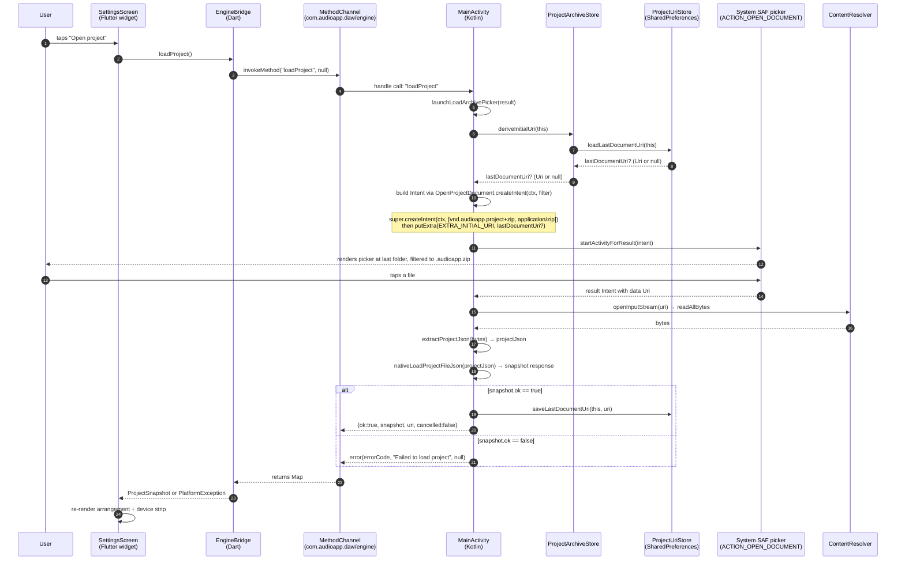
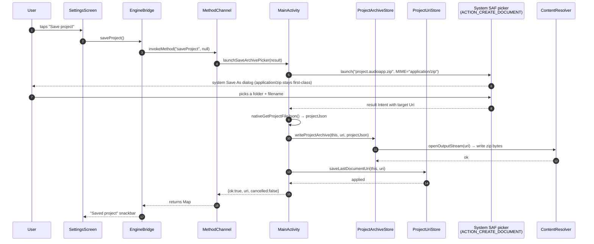

# Architecture Contract

## Current Architecture (broken — the bug)

```text
┌──────────────────────────────────────────────────────────────────┐
│  Flutter UI (Settings screen)                                    │
│    FilledButton.tonalIcon("Open project")                        │
│       └─ onLoadProject()  ──►  bridge.loadProject()              │
│                                  └─ invokeMethod("loadProject")  │
└──────────────────────────────────────────────────────────────────┘
                            │  MethodChannel
                            ▼
┌──────────────────────────────────────────────────────────────────┐
│  Android (MainActivity.kt:34-36, 51-58)                          │
│                                                                  │
│  openProjectArchive = registerForActivityResult(                │
│      ActivityResultContracts.OpenDocument()  ← no extra override│
│  )                                                               │
│                                                                  │
│  launchLoadArchivePicker(result):                                │
│      pendingLoadResult = result                                  │
│      openProjectArchive.launch(                                  │
│          arrayOf("application/zip", "application/octet-stream")  │
│      )   ← too-broad filter, no EXTRA_INITIAL_URI               │
└──────────────────────────────────────────────────────────────────┘
                            │
                            ▼
┌──────────────────────────────────────────────────────────────────┐
│  System SAF picker (ACTION_OPEN_DOCUMENT)                        │
│    - Opens at SAF default root (no hint of last folder)          │
│    - Shows every zip + every octet-stream on the device          │
│    - User has no idea where to navigate                          │
└──────────────────────────────────────────────────────────────────┘
```

**Three concrete problems (see `00-feature-brief.md` §"Root Cause"):**

1. No `EXTRA_INITIAL_URI` is attached.
2. MIME filter is `["application/zip", "application/octet-stream"]`.
3. `ActivityResultContracts.OpenDocument()` does not accept
   `EXTRA_INITIAL_URI` out of the box; we must subclass it.

## Target Architecture

```text
┌──────────────────────────────────────────────────────────────────┐
│  Flutter UI (Settings screen)                                    │
│    FilledButton.tonalIcon("Open project")                        │
│       └─ onLoadProject()  ──►  bridge.loadProject()              │
│                                  └─ invokeMethod("loadProject")  │
│                                                                   │   (unchanged)
└──────────────────────────────────────────────────────────────────┘
                            │  MethodChannel
                            ▼
┌──────────────────────────────────────────────────────────────────┐
│  Android (MainActivity.kt)                                       │
│                                                                   │
│  // Internal subclass of OpenDocument that adds EXTRA_INITIAL_URI │
│  // (internal, not private, so the same-package Kotlin unit tests │
│  //  in VP-2 can reference it)                                    │
│  internal class OpenProjectDocument :                           │
│      ActivityResultContracts.OpenDocument() {                    │
│      override fun createIntent(ctx, input): Intent {              │
│          val intent = super.createIntent(ctx, input)              │
│          ProjectArchiveStore.deriveInitialUri(ctx)?.let { uri ->  │
│              intent.putExtra(                                     │
│                  DocumentsContract.EXTRA_INITIAL_URI, uri)        │
│          }                                                         │
│          return intent                                             │
│      }                                                             │
│  }                                                                 │
│                                                                   │
│  openProjectArchive = registerForActivityResult(                 │
│      OpenProjectDocument()                                        │
│  ) { documentUri -> onLoadArchivePicked(documentUri) }            │
│                                                                   │
│  launchLoadArchivePicker(result):                                 │
│      pendingLoadResult = result                                   │
│      openProjectArchive.launch(                                   │
│          ProjectArchiveStore.OPEN_ARCHIVE_MIME_FILTER             │
│      )                                                            │
└──────────────────────────────────────────────────────────────────┘
                            │
                            ▼
┌──────────────────────────────────────────────────────────────────┐
│  System SAF picker (ACTION_OPEN_DOCUMENT)                         │
│    - Opens at the directory containing                            │
│      ProjectUriStore.last_document_uri                           │
│      (the parent folder of the user's last save/load)            │
│    - Filters by EXTRA_MIME_TYPES =                               │
│        [application/vnd.audioapp.project+zip, application/zip]    │
│    - Shows ONLY .audioapp.zip files (and vendor-tagged ones)      │
└──────────────────────────────────────────────────────────────────┘
```

### Sequence diagram — Load flow (target)



### Sequence diagram — Save flow (UNCHANGED, but anchored)

The save flow is **not** changed by this slice. We pin it here so
the architect's contract is unambiguous about what stays the same:



The save flow stays on `application/zip` (not the vendor MIME) so
the system's save dialog still offers `.zip` in the type dropdown
and can produce a real zip file the system providers understand.
The MIME we declare in the manifest is purely for the **load**
flow's filter; it does not need to be honored on write.

## Architecture Decision

**Decision:** Fix the SAF picker by attaching `EXTRA_INITIAL_URI`
(from `ProjectUriStore.last_document_uri`) and a tightened
`EXTRA_MIME_TYPES` array. No new UI, no app-scoped mirror
directory, no in-app list.

### Why this is the right shape

- **Per the user's instruction:** "Keep SAF, point it at a
  browseable folder." We do exactly that. No in-app Recent
  Projects screen.
- **Per `PROJECT-SPEC.md` §2.6:** "OS I/O: use platform save/open
  dialogs (Android SAF `CreateDocument` / `OpenDocument`)." We
  stay on SAF.
- **Per `PROJECT-SPEC.md` §2.7:** "the slice must be demo-able once on
  device." The wow moment is one tap, one picker, one load.
- **Per `PROJECT-SPEC.md` §2.5 ("Don't reinvent the wheel"):** the
  fix is a SAF `Intent` extras tweak, which is exactly the
  mechanism the platform gives us. No new framework, no new
  state, no new UI.

### Why we are NOT copying archives into `filesDir/projects/`

- The previous (wrong) contract proposed an app-scoped
  `filesDir/projects/` mirror directory. **The user
  explicitly rejected the in-app list direction**, so the
  mirror directory is no longer needed. Without a mirror,
  the file-system scan logic, the `filesDir/projects/` path,
  and the `listProjects` MethodChannel method all
  disappear from this contract.
- Mirroring the user's saved zip into app-private storage
  would also leave the user's primary copy (in their
  Downloads, Drive, etc.) out of sync if the app's copy is
  modified on load, which is exactly the kind of confusion
  §2.5 cautions against.

### Why a custom MIME type `application/vnd.audioapp.project+zip`

- Per **RFC 6838 §4.2.8** the `+<suffix>` structured-syntax
  convention is exactly the mechanism for "this is a
  vendor-specific format whose representation follows the
  `<suffix>` rules." Per **RFC 6839 §3.6**, `+zip` is a
  registered structured-syntax suffix. So
  `application/vnd.audioapp.project+zip` is RFC-compliant.
- It gives us a **distinct MIME** that SAF providers can
  use to filter our files. Declaring it in
  `AndroidManifest.xml` also lets the system recognize our
  app as a handler, so when the user opens a `.audioapp.zip`
  from elsewhere (Files app, email attachment, etc.), the
  system can route it back to us — a useful side effect
  even if our app does not yet handle that intent.
- We keep `application/zip` in the filter array as a
  fallback. Some SAF providers (e.g. older Files apps)
  won't know our vendor MIME and will only tag `.zip`
  files with `application/zip`. Having both in the array
  means our filter works across all supported providers.

### Why keep the save MIME as `application/zip` (not the vendor MIME)

- `ACTION_CREATE_DOCUMENT` requires a MIME the system can
  actually write. Most providers only accept
  `application/zip` for a real zip file. If we passed
  `application/vnd.audioapp.project+zip` to `CreateDocument`,
  the dialog would either:
  1. Refuse to open (no provider claims the MIME), or
  2. Fall back to "Save as type: zip" with no way for the
     user to know they are saving an "audioapp" archive.
- Keeping the save MIME as `application/zip` and only using
  the vendor MIME for the **load** filter is the
  recommended pattern (matches how Google Files and
  similar apps handle their formats).

### Why subclass `ActivityResultContracts.OpenDocument`

- The AndroidX `ActivityResultContracts.OpenDocument()`
  contract only sets `setType(input[0])` (or
  `EXTRA_MIME_TYPES` for arrays) — it does **not** add
  `EXTRA_INITIAL_URI`. Its API doc explicitly tells you
  to subclass it: *"This can be extended to override
  `createIntent` if you wish to pass additional extras."*
- The subclass is 8 lines of Kotlin and lives as a
  private nested class inside `MainActivity`. It calls
  `super.createIntent(ctx, input)` and adds the extra.
  No new dependency, no new Activity, no new Manifest
  entry.

## Module Boundaries

| Module | File(s) | Responsibility |
|--------|---------|----------------|
| **ProjectArchiveStore** (Kotlin, extended) | `app_flutter/android/.../ProjectArchiveStore.kt` | Add `PROJECT_MIME_TYPE`, `OPEN_ARCHIVE_MIME_FILTER`, `deriveInitialUri(context)`. **No change** to `buildArchiveBytes`, `extractProjectJson`, `writeProjectArchive`, `readProjectArchive`, `persistDocumentUri`. |
| **MainActivity** (Kotlin, extended) | `app_flutter/android/.../MainActivity.kt` | Add nested `OpenProjectDocument` contract class. Replace `openProjectArchive` registration. Update `launchLoadArchivePicker` to use the new filter array. **No change** to save flow, JNI signatures, or `jsonToMap` / `mapToJson` helpers. |
| **AndroidManifest** (XML, additive) | `app_flutter/android/app/src/main/AndroidManifest.xml` | Add `<intent-filter>` on `MainActivity` declaring the new vendor MIME. |
| **Gradle** (Kotlin DSL, additive) | `app_flutter/android/app/build.gradle.kts` | Enable Kotlin unit-test target (`testOptions.unitTests.isReturnDefaultValues = true`) and add `testImplementation("junit:junit:4.13.2")`. |
| **ProjectUriStore** (Kotlin, unchanged) | `app_flutter/android/.../ProjectUriStore.kt` | **No change.** The `loadLastDocumentUri` / `saveLastDocumentUri` API is reused as-is. |
| **Settings UI** (Dart, unchanged) | `app_flutter/lib/features/settings/settings_screen.dart` | **No change.** The button still calls `bridge.loadProject()`. |
| **EngineBridge** (Dart, unchanged) | `app_flutter/lib/bridge/engine_bridge.dart` | **No change.** |
| **DawShell** (Dart, unchanged) | `app_flutter/lib/app/daw_shell.dart` | **No change.** |
| **Engine** (C++, unchanged) | `engine_juce/**` | **No change.** |
| **Native bridge** (C++, unchanged) | `native_bridge/**`, `app_flutter/android/app/src/main/cpp/jni_bridge.cpp` | **No change.** |

## Threading / Async Boundaries

- All `MainActivity` code runs on the platform thread (the
  Android `HandlerThread` backed by the Flutter engine's
  executor). Already established.
- `SharedPreferences` reads (`ProjectUriStore.loadLastDocumentUri`)
  are blocking but tiny. Sub-millisecond on any real device.
- The SAF picker itself runs in the system process. Our
  code returns from `launch(...)` immediately; the picker
  callback is invoked on the platform thread when the user
  picks or cancels.
- The audio thread is **never** touched.

## Ownership Boundaries

- `ProjectArchiveStore` owns the MIME constants and the
  URI-derivation helper. `MainActivity` consumes them.
- `MainActivity` owns the `OpenProjectDocument` nested
  contract class. It is private and not exported.
- `AndroidManifest.xml` is shared with any future feature
  that needs to declare MIME handlers — the architect of
  any future work must keep the existing entries intact.
- The Dart side never knows about MIME types or
  `EXTRA_INITIAL_URI`; those are platform-internal details.

## Error Model

| Failure | Behavior |
|---------|----------|
| `ProjectUriStore.last_document_uri` is null (first run, or user cleared app data) | `deriveInitialUri` returns null; the `Intent` is built **without** `EXTRA_INITIAL_URI`; SAF opens at its default location. No error. |
| Stored URI is no longer accessible (user deleted the file from Files app, SAF grant revoked) | SAF falls back to its default location silently. The `Intent` extra is ignored by the system if the URI is invalid. No crash. |
| `OpenDocument.createIntent` throws (extremely unlikely; would require a bad system state) | `MainActivity.launchLoadArchivePicker` propagates as a `busy` error to the Dart side (existing pattern). |
| User cancels the picker | Existing `cancelled: true` response. No change. |
| User picks a non-zip (provider that mis-tags) | `readProjectArchive` will throw `IOException("project.json not found in archive")`; existing `load_failed` error path handles it. No change. |

No exceptions cross the JNI or MethodChannel boundary.

## Persistence Model

- **No new persistence.** `ProjectUriStore.last_document_uri`
  is already persisted in `SharedPreferences` (since the
  existing save/load flow saves it on both paths). The fix
  simply reads it on load and writes it again on every
  pick/load (which the existing flow already does).
- **No migration.** Files saved before this fix already
  have their URIs persisted; the next load uses them.

## UI / State Synchronization

- None. This slice touches zero UI. The existing
  `onLoadProject` → `bridge.loadProject()` →
  `_loadProject` path in `DawShell` is unchanged. The
  status snackbar ("Loaded project") continues to be set
  on success. The error path is unchanged.

## Rationale: rejecting the previous contract's design

The previous contract (`docs/features/load-project-zip-listing-fix/00-feature-brief.md`
prior to this rewrite) proposed:

1. **A new `listProjects` MethodChannel + in-app "Recent
   projects" UI.** **Rejected:** the user said "no in-app
   list, keep SAF, point it at a browseable folder."
2. **A `filesDir/projects/` mirror directory written on
   every save.** **Rejected:** no list UI means no need to
   mirror; the SAF-picked URI is the canonical home.
3. **A new `loadProjectByPath` MethodChannel for direct
   path loading.** **Rejected:** the existing
   `loadProject` flow already works through SAF; the fix
   only changes the **launch parameters**, not the
   **callback handling**.
4. **Multiple parallel work packages (VP-1..VP-4).**
   **Rejected:** the fix is one Kotlin change in one file
   (plus a 4-line manifest snippet and a 2-line
   `build.gradle.kts` change). It is one vertical slice.

The rewritten contract commits to the smaller surface
because that is what the user asked for.
