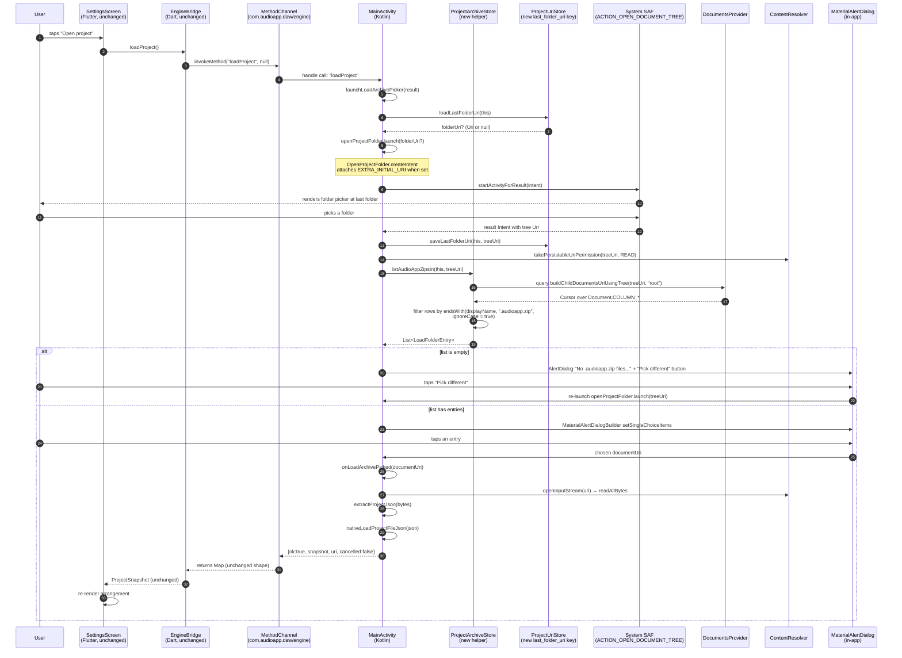
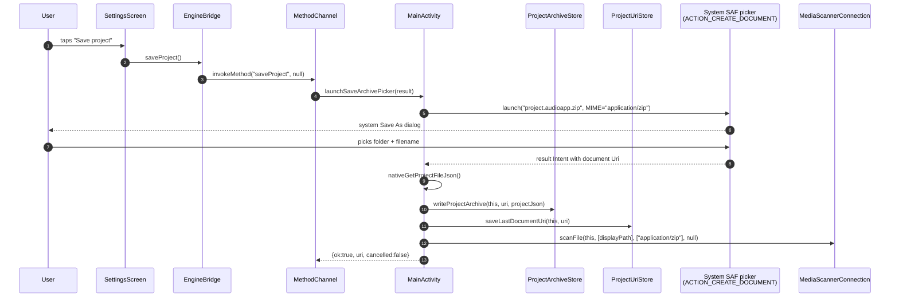

# Architecture Contract (VP-4)

## Current architecture (post-VP-3, still broken — the bug)

```text
┌─────────────────────────────────────────────────────────────────────┐
│  Flutter UI (Settings screen)                                       │
│    FilledButton.tonalIcon("Open project")                           │
│       └─ onLoadProject()  ──►  bridge.loadProject()                 │
│                                  └─ invokeMethod("loadProject")    │
└─────────────────────────────────────────────────────────────────────┘
                            │  MethodChannel
                            ▼
┌─────────────────────────────────────────────────────────────────────┐
│  Android (MainActivity.kt)                                          │
│                                                                     │
│  openProjectArchive = registerForActivityResult(                    │
│      OpenProjectDocument()  // ACTION_OPEN_DOCUMENT contract        │
│  ) { documentUri -> onLoadArchivePicked(documentUri) }              │
│                                                                     │
│  launchLoadArchivePicker(result):                                   │
│      openProjectArchive.launch(OPEN_ARCHIVE_MIME_FILTER)            │
└─────────────────────────────────────────────────────────────────────┘
                            │
                            ▼
┌─────────────────────────────────────────────────────────────────────┐
│  System SAF file picker (ACTION_OPEN_DOCUMENT)                      │
│                                                                     │
│  Backed by com.android.providers.media (MediaStore).                │
│  Filters children by mime_type column.                              │
│  - All 11 pre-VP-3 .audioapp.zip files have mime_type=NULL.         │
│  - MediaProvider excludes mime_type=NULL rows from any filter.      │
│  - Result: parent folder renders empty ("Keine Elemente").          │
└─────────────────────────────────────────────────────────────────────┘
```

The MIME-filter strategy is **fundamentally broken** on Android 11+ for
files indexed before our app installed. No MIME-filter tweak (VP-1,
VP-2, VP-3) can surface them. The system has chosen to hide them.

## Target architecture (VP-4)

```text
┌─────────────────────────────────────────────────────────────────────┐
│  Flutter UI (Settings screen)                                       │
│    FilledButton.tonalIcon("Open project")                           │
│       └─ onLoadProject()  ──►  bridge.loadProject()                 │
│                                  └─ invokeMethod("loadProject")    │
└─────────────────────────────────────────────────────────────────────┘
                            │  MethodChannel (unchanged)
                            ▼
┌─────────────────────────────────────────────────────────────────────┐
│  Android (MainActivity.kt)                                          │
│                                                                     │
│  openProjectFolder = registerForActivityResult(                     │
│      OpenProjectFolder()  // ACTION_OPEN_DOCUMENT_TREE contract     │
│  ) { folderUri -> onFolderPicked(folderUri) }                       │
│                                                                     │
│  launchLoadArchivePicker(result):                                   │
│      openProjectFolder.launch(initialFolderUri?)                    │
│                                                                     │
│  onFolderPicked(folderUri):                                         │
│      ProjectUriStore.saveLastFolderUri(this, folderUri)             │
│      ProjectArchiveStore.takeFolderUriPermission(this, folderUri)   │
│      val entries = ProjectArchiveStore.listAudioAppZipsIn(          │
│          this, folderUri)                                           │
│      showLoadFolderDialog(entries)                                  │
│            │                                                        │
│            ├─ empty   → AlertDialog "No .audioapp.zip files in      │
│            │            this folder" + "Pick a different folder"    │
│            │            button → re-launches openProjectFolder     │
│            └─ entries → MaterialAlertDialogBuilder.setSingleChoice   │
│                         Items(displayName, size, lastModified)      │
│            │                                                        │
│            └─ onItemClick(uri): onLoadArchivePicked(uri)            │
│                                  (existing path; reads bytes,       │
│                                   calls native, returns snapshot)   │
└─────────────────────────────────────────────────────────────────────┘
                            │
                            ▼
┌─────────────────────────────────────────────────────────────────────┐
│  System SAF folder picker (ACTION_OPEN_DOCUMENT_TREE)               │
│                                                                     │
│  Returns a tree URI:                                                │
│  content://com.android.externalstorage.documents/tree/              │
│    primary%3AProjects                                                │
│                                                                     │
│  No MIME filter — the picker is folder-only; it does not query      │
│  MediaStore children. It returns a tree URI for a chosen directory. │
│  Children are then enumerated via                                   │
│  DocumentsContract.getChildDocuments(treeUri), which uses the       │
│  DocumentsProvider for that authority — typically the local         │
│  DocumentsProvider on /storage/emulated/0/..., which does NOT        │
│  consult MediaStore.mime_type.                                       │
└─────────────────────────────────────────────────────────────────────┘
```

### Why the folder route works when the file route did not

- `ACTION_OPEN_DOCUMENT_TREE` is backed by `DocumentsProvider` (the
  storage provider for the chosen root), not by `MediaProvider`. It
  returns a **tree URI** (e.g. `content://.../tree/primary%3AProjects`),
  not a child document URI.
- To list a tree's children we call
  `DocumentsContract.buildChildDocumentsUriUsingTree(treeUri, "root")` and
  query the `DocumentsContract.Document` columns
  (`COLUMN_DISPLAY_NAME`, `COLUMN_MIME_TYPE`, `COLUMN_LAST_MODIFIED`,
  `COLUMN_SIZE`). The query goes through the DocumentsProvider, which
  enumerates the underlying filesystem directly. **It does not require
  a MediaStore index** and does not filter by `mime_type`. It returns
  every child, including files with `mime_type=NULL`.
- We then filter the cursor's `COLUMN_DISPLAY_NAME` values ourselves
  using `endsWith(PROJECT_FILE_SUFFIX, ignoreCase = true)`. The MIME
  column is irrelevant for our filter; we drop it on the floor.

This sidesteps MediaStore entirely. The `mime_type=NULL` problem
disappears because we never ask MediaStore.

### Why the listing dialog lives on the Kotlin side (binding decision)

The user's brief considered Kotlin vs Flutter for the listing UI. The
architect commits to **Kotlin side, native `MaterialAlertDialog`** for
these reasons:

1. **No Flutter / Dart changes.** The user explicitly listed "No new
   Flutter UI" as a constraint. A Dart-side `showModalBottomSheet`
   would require (a) a new Dart widget, (b) a new
   `listLoadFolder` MethodChannel method (to ferry the entries from
   Kotlin), and (c) a callback MethodChannel to send the chosen URI
   back. That is two new MethodChannel methods plus a Flutter widget
   and an engine_bridge.dart change.
2. **Wire format unchanged.** The existing constraint is "the
   `loadProject` MethodChannel still returns the same bytes." A
   Kotlin-side dialog means we keep the entire load path on the
   existing wire: after the user picks a file in the in-app dialog,
   we invoke the **exact same** `onLoadArchivePicked(uri)` flow that
   a file-picker URI would have invoked. The MethodChannel response
   is identical to today.
3. **Native dialogs integrate cleanly with SAF.** The system folder
   picker returns on `onActivityResult`. We can show a follow-up
   `MaterialAlertDialogBuilder` directly. There is no async ping-pong
   to Dart; we just keep the `pendingLoadResult` around (it already
   exists) until the in-app dialog resolves.
4. **No Dart rebuilds.** The `loadProject` MethodChannel call site
   in `engine_bridge.dart` is unchanged. `flutter build apk --debug`
   need not rebuild the Flutter artifact.

The native `MaterialAlertDialogBuilder` is the simplest UI host that
sails through all four constraints.

## Sequence — Load flow (VP-4 target)



### Sequence — Save flow (UNCHANGED, pinned)



The save flow keeps VP-3's `MediaScannerConnection.scanFile` call so new
saves get a real `application/zip` MediaStore row. This is no longer the
load-path mechanism (the load path now uses folder+listing), but it
remains correct hygiene: any third-party app that *does* use MediaStore
to enumerate audioapp projects will see them.

## Architecture decisions (committed)

### 1. Folder picker (`ACTION_OPEN_DOCUMENT_TREE`) over file picker

**Decision:** Use `ACTION_OPEN_DOCUMENT_TREE` for the load flow. Drop
`ACTION_OPEN_DOCUMENT` entirely for load.

**Rationale:**

- File pickers backed by MediaProvider exclude `mime_type=NULL` rows on
  Android 11+. Folder pickers backed by DocumentsProvider do not.
- We already have `DocumentsContract` imported (used for
  `EXTRA_INITIAL_URI` and `findDocumentPath`); no new imports.
- The user's folder hint (`last_folder_uri`) is a natural piece of
  state to persist.

**Rejected alternatives:**

- Rescanning from `adb shell am broadcast`: not viable from a normal
  user-installed app on Android 11+.
- Asking the user for `MANAGE_EXTERNAL_STORAGE`: Play Store policy
  forbids this for apps that do not have a file-manager-style core
  function; we are a DAW.
- An in-app project mirror in `filesDir/projects/`: rejected in VP-1;
  user said "no in-app list, keep SAF, point it at a browseable
  folder."

### 2. Listing dialog on the Kotlin side

**Decision:** `MaterialAlertDialogBuilder` inside `MainActivity`, no Dart
involvement.

**Rationale:** see "Why the listing dialog lives on the Kotlin side"
above.

### 3. Listing filter by filename suffix (not by MIME)

**Decision:** Filter the `DocumentsContract.Document.COLUMN_DISPLAY_NAME`
column with `endsWith(".audioapp.zip", ignoreCase = true)`. Ignore
`COLUMN_MIME_TYPE`.

**Rationale:**

- The whole point of the folder route is to sidestep MediaStore/MIME
  matching. If we filtered by `COLUMN_MIME_TYPE`, we would re-introduce
  the very bug we just escaped (the OEM provider may tag
  `.audioapp.zip` with `application/octet-stream`, `application/zip`,
  `application/vnd.audioapp.project+zip`, or `NULL`, depending on
  indexing state).
- The filename suffix is stable and authoritative. We always write
  `.audioapp.zip` (see `ProjectArchiveStore.DEFAULT_ARCHIVE_NAME`).
- Case-insensitivity is defensive: some Files apps and OEM save
  dialogs may preserve the user's casing, which can differ from our
  canonical lowercase suffix.

### 4. Persist folder URI in a separate `SharedPreferences` key

**Decision:** Add `KEY_LAST_FOLDER_URI = "last_folder_uri"` to
`ProjectUriStore`. Keep the existing `KEY_LAST_DOCUMENT_URI` intact.

**Rationale:**

- The two URIs are different shapes (tree vs document) and live in
  different SAF scopes (`FLAG_GRANT_READ_URI_PERMISSION` is granted
  separately for each pick).
- Re-using `last_document_uri` would require tagging the value
  (`tree:` / `document:`) and complicate parsing for every existing
  caller (save flow, load flow).
- Existing saved files are still re-openable: the user just navigates
  to the folder that contains them and picks from the in-app list.
  We never **need** to re-open from a raw `last_document_uri` after
  VP-4, because the in-app list surfaces the same files. The
  `last_document_uri` key is preserved only so any external tooling
  or future slices can still read it; no production code path writes
  or reads it from the load flow after VP-4.

### 5. `OPEN_ARCHIVE_MIME_FILTER` is deleted

**Decision:** Delete `ProjectArchiveStore.OPEN_ARCHIVE_MIME_FILTER`.
The save flow keeps `ARCHIVE_MIME_TYPE = "application/zip"` (it uses
`ACTION_CREATE_DOCUMENT`, not the tree picker, so the MIME is still
needed for the save dialog).

**Rationale:**

- The new load flow is a tree picker. Tree pickers do not accept a
  MIME filter — there is no `EXTRA_MIME_TYPES` for
  `ACTION_OPEN_DOCUMENT_TREE`.
- The array served no purpose after VP-4. Keeping it as dead code is
  worse than deleting it: future readers will assume it is used.

### 6. Permission grant via `takePersistableUriPermission`

**Decision:** On every folder pick, call
`contentResolver.takePersistableUriPermission(treeUri,
Intent.FLAG_GRANT_READ_URI_PERMISSION)`.

**Rationale:**

- Without persistable permission, the tree URI grant is good only for
  the lifetime of the process. After a reboot or process death, the
  URI in `last_folder_uri` would be unusable, the folder picker would
  not be able to land there, and `DocumentsContract.getChildDocuments`
  on the saved tree URI would throw `SecurityException`.
- With persistable permission, the URI survives reboots. We already
  call this in `ProjectArchiveStore.persistDocumentUri` for file URIs;
  this is the same pattern, scoped to a new helper
  `ProjectArchiveStore.takeFolderUriPermission`.

## Module boundaries

| Module | File(s) | Responsibility |
|--------|---------|----------------|
| **ProjectArchiveStore** (Kotlin, extended) | `ProjectArchiveStore.kt` | Add `PROJECT_FILE_SUFFIX`. Add `listAudioAppZipsIn(context, treeUri): List<LoadFolderEntry>`. Add `takeFolderUriPermission(context, treeUri)`. **Delete** `OPEN_ARCHIVE_MIME_FILTER`. **No change** to `buildArchiveBytes`, `extractProjectJson`, `writeProjectArchive`, `readProjectArchive`, `persistDocumentUri`, `PROJECT_MIME_TYPE`, `ARCHIVE_MIME_TYPE`. |
| **MainActivity** (Kotlin, extended) | `MainActivity.kt` | **Delete** `OpenProjectDocument` nested class (no longer used). **Add** `OpenProjectFolder` nested class (subclass of `OpenDocumentTree`). Replace `openProjectArchive` registration with `openProjectFolder`. Add `onFolderPicked(uri: Uri?)`. Add `showLoadFolderDialog(entries: List<LoadFolderEntry>)`. Add `showEmptyLoadFolderDialog()`. **No change** to save flow, `launchSaveArchivePicker`, `onSaveArchivePicked`, `createProjectArchive`, `launchImportSamplePicker`, `launchExportMixPicker`, `onExportWavPicked`, `onImportSamplePicked`, `configureFlutterEngine` `when` cases, `queryDisplayPathFromUri`, `acquirePlaybackWakeLock`, `releasePlaybackWakeLock`, JNI declarations, or `jsonToMap` / `mapToJson`. |
| **ProjectUriStore** (Kotlin, extended) | `ProjectUriStore.kt` | Add `KEY_LAST_FOLDER_URI = "last_folder_uri"`. Add `saveLastFolderUri(context, folderUri: Uri)`. Add `loadLastFolderUri(context: Context): Uri?`. **No change** to `KEY_LAST_DOCUMENT_URI`, `saveLastDocumentUri`, `loadLastDocumentUri`. |
| **LoadFolderEntry** (new Kotlin data class) | `ProjectArchiveStore.kt` (same file) | `data class LoadFolderEntry(val documentUri: Uri, val displayName: String, val sizeBytes: Long, val lastModifiedMillis: Long)`. Lives next to `ProjectArchiveStore.listAudioAppZipsIn`. |
| **AndroidManifest.xml** | (unchanged) | VP-4 does **not** touch the manifest. The vendor-MIME `<intent-filter>` added in VP-1 is preserved (still useful for inbound `ACTION_VIEW` from other apps). |
| **build.gradle.kts** | (unchanged) | VP-4 does **not** touch Gradle. `testOptions.unitTests.isReturnDefaultValues = true` and `testImplementation("junit:junit:4.13.2")` are already present from VP-1. |
| **Settings UI** (Dart, unchanged) | `app_flutter/lib/features/settings/settings_screen.dart` | **No change.** The button still calls `bridge.loadProject()`. |
| **EngineBridge** (Dart, unchanged) | `app_flutter/lib/bridge/engine_bridge.dart` | **No change.** |
| **Engine** (C++, unchanged) | `engine_juce/**` | **No change.** |

## Threading / async boundaries

- All `MainActivity` code runs on the platform thread (Android
  `HandlerThread` backed by the Flutter engine's executor). Already
  established.
- SAF folder picker launch returns immediately; the picker callback is
  invoked on the platform thread when the user picks or cancels.
- `DocumentsContract.getChildDocuments(...)` query runs on the platform
  thread. Folder contents are bounded (the user picked the folder; a
  realistic folder has tens to hundreds of children). Sub-100ms in
  practice. If we ever worry about latency on huge folders, we move
  the query to a worker thread and post the dialog back — but for the
  MVP, blocking the platform thread for <100ms is acceptable.
- `MaterialAlertDialogBuilder.show()` is the standard Android dialog
  pattern; the user interaction is synchronous from our perspective.
- `SharedPreferences` reads (`ProjectUriStore.loadLastFolderUri`) are
  blocking but tiny. Sub-millisecond.
- The audio thread is **never** touched.

## Ownership boundaries

- `ProjectArchiveStore` owns:
  - The canonical `PROJECT_FILE_SUFFIX` constant.
  - The `LoadFolderEntry` data class.
  - The `listAudioAppZipsIn` enumeration helper.
  - The `takeFolderUriPermission` persistable-permission helper.
  - `MainActivity` consumes these.
- `ProjectUriStore` owns:
  - `KEY_LAST_FOLDER_URI` and the read/write helpers.
  - The existing `KEY_LAST_DOCUMENT_URI` is unchanged.
- `MainActivity` owns:
  - The `OpenProjectFolder` nested contract class.
  - The `onFolderPicked` callback.
  - The `showLoadFolderDialog` and `showEmptyLoadFolderDialog` UI
    helpers.
- The Dart side never knows about folder URIs, tree pickers, or
  `MaterialAlertDialogBuilder`; those are platform-internal details.

## Error model

| Failure | Behavior |
|---------|----------|
| `last_folder_uri` is null (first run, user cleared app data) | Folder picker opens at system default. No error. |
| Stored folder URI is revoked (user deleted the folder) | Folder picker falls back to system default. No crash. |
| User cancels the folder picker | Existing `cancelled: true` response. No change. |
| User picks a folder, but it contains no `.audioapp.zip` files | `MaterialAlertDialog` shows "No .audioapp.zip files in this folder" with a "Pick a different folder" button. The current pending `MethodChannel.Result` is still held until the user either picks a different folder (re-launches the picker) or cancels. |
| `DocumentsContract.getChildDocuments` throws (provider doesn't support the tree URI) | Fall back to `showEmptyLoadFolderDialog` with the same "Pick a different folder" UI; log a warning. No `MethodChannel.Result.error` — the user can retry. |
| `takePersistableUriPermission` throws `SecurityException` | Already handled by existing pattern in `persistDocumentUri` (catch and ignore; session grant is sufficient for the immediate `getChildDocuments` call). We do not retry or surface an error. |
| User picks a file that fails to parse as an audioapp archive | Existing `readProjectArchive` throws `IOException("project.json not found in archive")`; existing `load_failed` error path handles it. No change. |

No exceptions cross the JNI or MethodChannel boundary.

## Persistence model

- **One new key:** `last_folder_uri` in `SharedPreferences("audioapp_project_store")`.
  Persisted on every successful folder pick. Read on every load
  launch.
- **No migration.** `last_folder_uri` is null on first launch after
  VP-4 and is populated on the first successful folder pick.
  `last_document_uri` is preserved unchanged (existing key).

## UI / state synchronization

- The slice touches zero Flutter UI. The Flutter side's `loadProject`
  call site is unchanged: `await widget.bridge.loadProject()` is
  invoked; the result is `ProjectSnapshot`.
- The Kotlin side shows a native `MaterialAlertDialog`. It is dismissed
  automatically when the user taps a file (or "Cancel") and the result
  is returned to Dart via the existing `MethodChannel.Result.success(...)`
  call.
- The dialog's "Pick a different folder" button does **not** resolve
  the `MethodChannel.Result` — it just dismisses the dialog and
  re-launches the folder picker with the same `EXTRA_INITIAL_URI`.
  The `MethodChannel.Result` is held the entire time.
